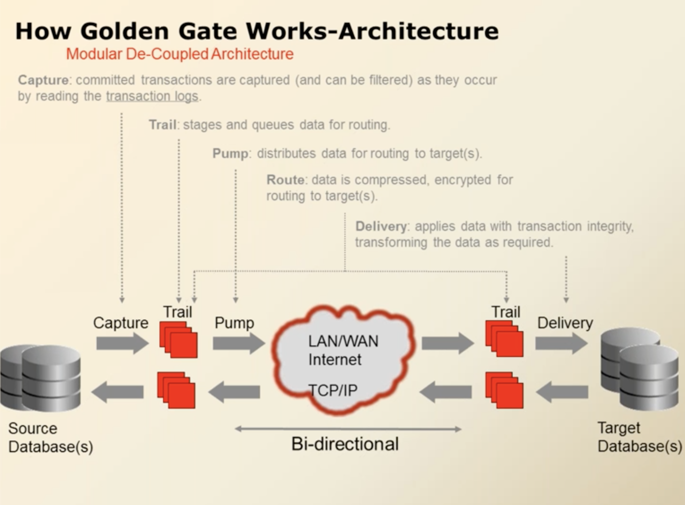
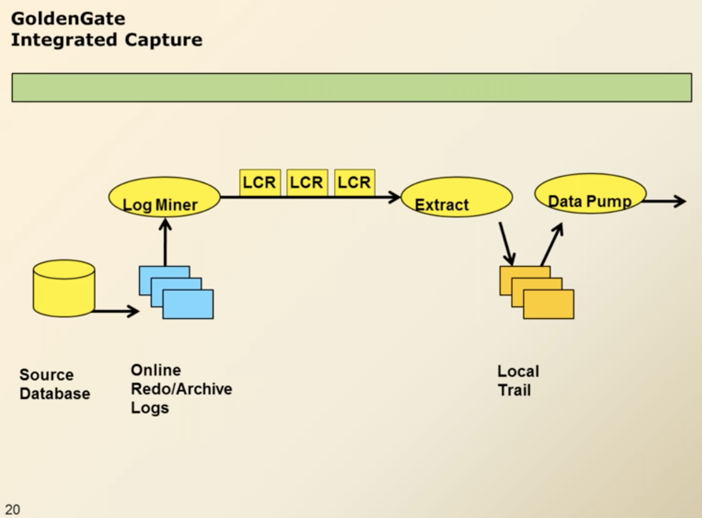

Every DB keeps its own transaction logs.
- Transactions logs is called redo logs in Oracle DB.
- Backup of redo logs are archive logs.

Goldengate captures committed transactions:
1. Writes them to the trail files on your local machine (local trail) which are called the binary format trail files.
2. Pumps the data to a remote trail (another machine having GG and the target DB)
3. Target GG reads the data of the remote trail and apply it to target.

GoldenGate process:  
Source process:
1. Extract process: captures the changes in the data.
2. Writes the data into the local trail (trail files are the storage in goldengate).
3. Data pump process: pumping the data from source (local trail) to target (remote trail).  

Target process:
1. Delivery or replicate: writing the data based on the trails received.  

### Classic extract architecture
Note the following architecture is a classic extract bi-directional architecture.  
> The performance issue with the classic extract architecture is that it establishes a connection with the DB

  
  
The solution for this is a relatively new architecture called integrated extract it is 5 times faster but it is only for Oracle DB.

### Integrated extract
This architecture is only available for Oracle DB.
in this architecture we find:
1. a log miner related to the database
2. GoldenGate receives the logs from the log miner in the form of LCR. LCR stands for Logical Change Records.  
> The reason for the integrated extract to be faster is that the log miner only sends the required logs instead of going through all the logs of all the tables in the database which includes as well system and system tables.  

  
  
